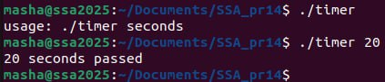

## Завдання 1 
### Варіант 9

Реалізуйте CLI-таймер, який виводить повідомлення через рівно N секунд без використання сигналів (через clock_nanosleep()).

### *Результат*

### *Пояслення*
Програма чекає рівно N секунд і виводить повідомлення, використовуючи сучасну функцію clock_nanosleep(). Вона не використовує сигнали, як старі механізми на кшталт alarm() чи setitimer(), тому є простішою й стабільнішою. Це приклад синхронного таймера, який працює точно і зручно для простих задач без асинхронної обробки.
